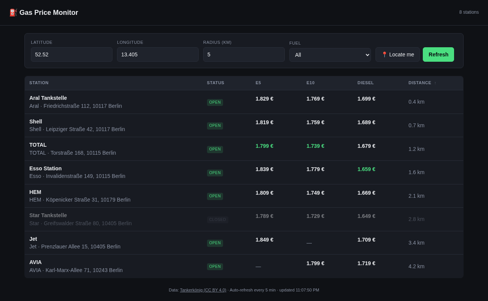

# Gas Price Monitor


Local web dashboard for German fuel prices powered by the
[Tankerkönig](https://creativecommons.tankerkoenig.de/) open data API. It finds
nearby stations, highlights the cheapest open prices for E5, E10, and Diesel,
and calculates the best real-world fill-up value after accounting for the drive.

The app is a small Bun + TypeScript service: a static dashboard, a server-side
API proxy so the Tankerkönig key never reaches the browser, disk caching for fair
use, geocoding, price history, and optional price-drop alerts.

## Screenshot

The screenshot is captured from the deterministic Playwright test server, so it
shows a realistic UI state without using live API keys.

<p align="center">
  
</p>

## Features

- Location search for German places, streets, and postal codes via
  [Photon](https://photon.komoot.io/) / OpenStreetMap.
- Browser geolocation support for "near me" searches.
- Fuel filters for `All`, `E5`, `E10`, and `Diesel`.
- Cheapest open station highlighting per fuel.
- **Best Value** calculation that combines fuel price, fill volume, station
  distance, and vehicle consumption into net `€/fill`.
- Sortable desktop table and mobile station cards.
- 7-day price sparklines backed by local `data/history.jsonl`.
- Server-side 5-minute Tankerkönig cache and 24-hour geocoder cache.
- Optional desktop or webhook alerts when prices cross configured thresholds.
- Docker image publishing to GitHub Container Registry.

## Quick Start

Requirements:

- [Bun](https://bun.sh/) 1.x
- A free Tankerkönig API key from
  <https://creativecommons.tankerkoenig.de/#about>

Install dependencies:

```sh
bun install
```

Create local configuration:

```sh
cp .env.example .env
```

Edit `.env` and set:

```sh
TANKERKOENIG_API_KEY=your-key
PHOTON_USER_AGENT=gas-price-monitor (you@example.com)
```

`PHOTON_USER_AGENT` is required. Use an identifier with a contact address so the
Photon operator can reach you if your geocoder traffic misbehaves.

Run the app:

```sh
bun run dev
```

Open <http://localhost:3000>.

For a non-hot-reload server:

```sh
bun run start
```

## Usage Notes

- Search for a location such as `Berlin Mitte`, `Stuttgart Hauptbahnhof`, or a
  street address, then pick a result.
- Use arrow keys and Enter in the location dropdown, or Escape to close it.
- Adjust radius, fuel, fill volume, and consumption to model your actual trip.
- When fuel is set to `All`, Best Value tracks E10 and marks the header with
  an asterisk.
- Preferences are saved in `localStorage`, including location, radius, fuel,
  fill volume, and consumption.
- The dashboard refreshes every 5 minutes to stay inside Tankerkönig fair-use
  expectations.
- This is a local/personal tool with no authentication. Put an auth layer in
  front of it before exposing it beyond a trusted network.

## Configuration

| Env var | Default | Notes |
| --- | --- | --- |
| `TANKERKOENIG_API_KEY` | | Required for `/api/stations`. |
| `PHOTON_USER_AGENT` | | Required. Sent to Photon geocoder. |
| `PHOTON_BASE_URL` | `https://photon.komoot.io` | Override for tests or self-hosted Photon. |
| `GEOCODE_CACHE_TTL_MS` | `86400000` | 24-hour geocoder cache. |
| `GEOCODE_CACHE_MAX_ENTRIES` | `200` | LRU pruned on write. |
| `PORT` | `3000` | HTTP server port. |
| `DEFAULT_LAT` | `52.5200` | Default center, Berlin Mitte. |
| `DEFAULT_LNG` | `13.4050` | Default center, Berlin Mitte. |
| `DEFAULT_RADIUS` | `5` | Search radius in km, from 1 to 25. |
| `CACHE_DIR` | `.cache` | Station and geocoder cache directory. |
| `CACHE_TTL_MS` | `300000` | 5-minute station cache. |
| `CACHE_MAX_ENTRIES` | `200` | LRU pruned on write. |
| `DATA_DIR` | `data` | History and alert state directory. |
| `HISTORY_MAX_FILE_BYTES` | `52428800` | Rotates `history.jsonl` after 50 MB. |
| `ALERT_E5_BELOW` | | Alert threshold in `€/L`. |
| `ALERT_E10_BELOW` | | Alert threshold in `€/L`. |
| `ALERT_DIESEL_BELOW` | | Alert threshold in `€/L`. |
| `ALERT_DESKTOP_NOTIFY` | `false` | Set `true` for Linux `notify-send` popups. |
| `ALERT_WEBHOOK_URL` | | POST alert JSON to this URL. |

Invalid environment values fail fast at startup with a clear error.

## API

| Endpoint | Description |
| --- | --- |
| `GET /` | Dashboard UI. |
| `GET /api/config` | Public defaults and flags such as `hasApiKey` and `alertsEnabled`. |
| `GET /api/stations?lat=&lng=&radius=&type=` | Proxies Tankerkönig `list.php` with disk caching. `type` is `e5`, `e10`, `diesel`, or `all`. |
| `GET /api/geocode?q=...` | Returns up to 5 Photon geocoder results as `{ label, lat, lng }`. |
| `GET /api/history?stationIds=A,B,C&days=7` | Returns grouped historical prices for up to 50 station IDs. |

`radius` must be between 1 and 25 km. Out-of-range values return HTTP 400.

## Development

```sh
bun run typecheck
bun test tests/
bun run test:e2e
```

The Playwright E2E suite runs against `e2e/test-server.ts`, which serves the
real frontend with mocked Tankerkönig and Photon responses.
The checked-in README screenshot in `docs/` was captured from that same
mocked server, so it can be refreshed without live API credentials.

## Container / Kubernetes

Every push to `main` builds a `linux/amd64` image and publishes it to:

```text
ghcr.io/nachtschatt3n/gas-price-monitor
```

Tags:

- `latest` for `main`
- `sha-<short>` for each commit
- `v<tag>` for git tags

Reference Kubernetes manifests live in [`k8s/`](k8s/README.md):

```sh
kubectl create secret generic gas-price-monitor --from-literal=api-key=YOUR_KEY
kubectl apply -f k8s/deployment.yaml -f k8s/service.yaml
kubectl port-forward svc/gas-price-monitor 3000:80
```

The sample deployment uses ephemeral `emptyDir` volumes for `/data` and
`/cache`. Swap in a persistent volume claim if you want price history to survive
pod restarts.

For the `cberg-home-nextgen` homelab, Flux rollout ownership is documented in
[`CLAUDE.md`](CLAUDE.md).

## Data and License

Fuel price data comes from Tankerkönig and is licensed under CC BY 4.0. Photon
geocoding uses OpenStreetMap data under ODbL.

Project code: do what you want.
